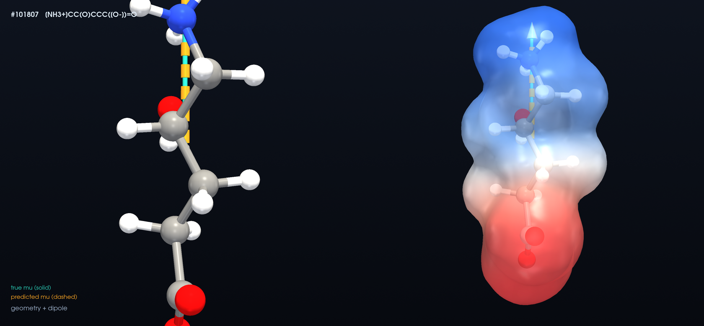

# TopoResponse

**Topology-conditioned E(3)-equivariant prediction of molecular dipole moments and polarizability tensors.**

DLS course project. Given a molecule's 3D geometry, predict its dipole moment vector (μ, an ℓ=1 vector) and dipole polarizability tensor (α, ℓ=0 ⊕ ℓ=2) with an E(3)-equivariant network, and study whether **persistent-homology (TDA) features** add predictive value beyond a strong equivariant model — especially under **distribution shift** (topology / size / conformation OOD).

## Why

Equivariant message passing (PaiNN, MACE, …) already predicts molecular response tensors well. Persistent homology contributes a **global, isometry-invariant, noise-robust** inductive bias that local message passing can miss. The question is whether that bias measurably helps, and where — the interesting regime is out-of-distribution generalization, not the saturated in-distribution benchmark. Honest expected outcome: modest accuracy gain + stronger robustness/OOD; rigorous negative controls make even a null result informative.

## Data

[SQuIRL](https://doi.org/10.6084/m9.figshare.30734843) — 133,883 QM9 molecules (ωB97X-D/aug-cc-pVTZ) with the **dipole moment vector** and full **3×3 polarizability tensor** already computed (no re-computation needed). Physical sanity checks pass: methane α isotropic; ammonia C₃ᵥ (two equal + one distinct eigenvalue); anisotropic tensors respect point-group symmetry.

## Method

- **Backbone**: E(3)-equivariant network (SchNetPack PaiNN) with dipole (ℓ=1) and polarizability (ℓ=0⊕ℓ=2) heads.
- **TDA conditioning** (irrep-preserving): per-molecule H₀/H₁ persistence of the 3D point cloud → persistence features z_PH that gate channel mixing *within each irrep* (exact equivariance preserved), not appended to Cartesian components.
- **Splits**: random · topology-OOD (train few-ring → test ring-rich) · size-OOD.
- **Controls**: shuffled TDA, random features of equal dimension, ring-count baseline, larger receptive field without TDA, matched parameter count.
- **Metrics**: dipole vector MAE + angular error; polarizability Frobenius, isotropic/anisotropic split, eigenvalue error; exact equivariance check.

## Interactive visualization

*#101807 `[NH3+]CC(O)CCC([O-])=O`. The charge separation between the ammonium and carboxylate ends — blue and red on the density — is exactly what the dipole vector measures. Density: RHF/6-31G* at the SQuIRL geometry, isosurface 0.002 e/a₀³; potential from charges fitted to the QM electrostatic potential. Generated by `make_density_cubes.py` and `render_hero.py`.*

`index.html` — a WebGL viewer showing true vs predicted dipole vectors on real molecular geometries, with live angular/magnitude error. Live (GitHub Pages): **https://mindvisio.github.io/topo-response/**

## Status

Work in progress. Data pipeline + TDA features done; equivariant dipole baseline training; polarizability head + TDA conditioning + OOD/controls next.

## Structure

- `data_squirl.py` — SQuIRL loader (geometry, μ vector, α tensor) + splits
- `build_index.py` — molecule index + split generation
- `compute_zph.py` — persistent-homology (H₀/H₁) features
- `train_dipole.py` — equivariant PaiNN dipole training
- `index.html` — interactive dipole viewer
