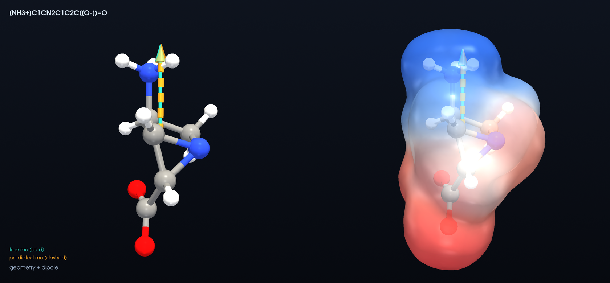
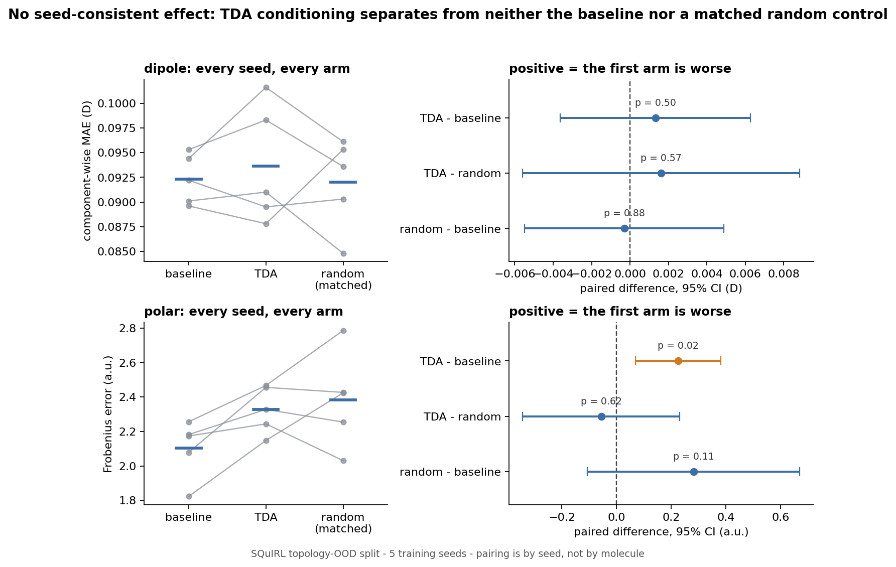
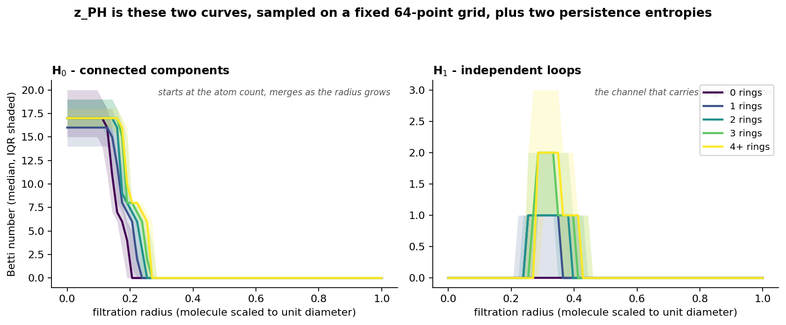

# TopoResponse

**Does persistent homology help an E(3)-equivariant network predict molecular dipole moments and polarizability tensors? A controlled study whose answer, in this configuration, is no.**

Course project for the Deep Learning School (DLS). Given a molecule's 3D geometry, predict its dipole moment vector (μ, an ℓ=1 vector) and dipole polarizability tensor (α, ℓ=0 ⊕ ℓ=2) with an E(3)-equivariant network, and study whether **persistent-homology features**, drawn from topological data analysis (TDA), add predictive value beyond a strong equivariant model — especially under **distribution shift**. The reported study uses the topology-OOD split; size- and conformation-OOD were scoped but not run.

## Why

Equivariant message passing (PaiNN, MACE, …) already predicts molecular response tensors well. Persistent homology contributes a **global, isometry-invariant, noise-robust** inductive bias that local message passing can miss. The question is whether that bias measurably helps, and where — the interesting regime is out-of-distribution (OOD) generalization, not the saturated in-distribution benchmark. The prior expectation was a modest accuracy gain and better OOD robustness. It did not materialise (see [Status](#status)), which is exactly why the matched negative controls were built in from the start: they are what makes a null result informative rather than merely inconclusive.

## Data

[SQuIRL](https://doi.org/10.6084/m9.figshare.30734843), the Spectral Quantum Chemistry and Infrared Resonance Library — 133,885 QM9 molecules (ωB97X-D/aug-cc-pVTZ) with the **dipole moment vector** and full **3×3 polarizability tensor** already computed (no re-computation needed). This study uses the **133,883 records present in the processed index**; two identifiers (1550 and 65111) are absent from it, hence the small gap against the 133,885 quoted by the dataset paper. Physical sanity checks pass: methane α isotropic; ammonia C₃ᵥ (two equal + one distinct eigenvalue); anisotropic tensors respect point-group symmetry.

## Method

- **Backbone**: E(3)-equivariant network (SchNetPack PaiNN) with dipole (ℓ=1) and polarizability (ℓ=0⊕ℓ=2) heads.
- **z_PH descriptor (130-D)**: Vietoris–Rips persistence of the 3D point cloud, over *all* atoms and using *no* element information. Coordinates are centered and divided by the molecular diameter, so every filtration value falls in [0,1] and one fixed 64-point grid is shared by all molecules. The vector concatenates the H₀ and H₁ Betti curves on that grid (64 + 64) with the two persistence entropies.
- **TDA conditioning** (feature-wise linear modulation): z_PH passes through a small network whose output modulates the backbone's *final* representation — a per-channel scale and shift on the invariant (scalar) channels, and a single invariant multiplicative gate on the equivariant (vector) channels. It is applied after the backbone and never mixes irreducible representations (*irreps*), so exact E(3) equivariance is preserved. The last layer is zero-initialized, so at initialization the conditioned model reproduces the baseline exactly.
- **Splits**: random · topology-OOD (train few-ring → test ring-rich) · group-random (molecules grouped by canonical SMILES, whole groups assigned at random).
- **Controls run**: shuffled z_PH, matched-capacity random features of equal dimension, and an element-augmented 4D persistence variant. A ring-count baseline, a larger-receptive-field baseline and a separate matched-parameter baseline were scoped but not run.
- **Metrics**: dipole vector MAE + angular error; polarizability Frobenius, isotropic/anisotropic split, eigenvalue error; exact equivariance check.

## Interactive visualization



*`[NH3+]C1CN2C1C2C([O-])=O`, a held-out test molecule. The charge separation between the ammonium and carboxylate ends — blue and red on the density — is exactly what the dipole vector measures. Density: RHF/6-31G* at the SQuIRL geometry, isosurface 0.002 e/a₀³; potential from charges fitted to the QM electrostatic potential. Generated by `make_density_cubes.py` and `render_hero.py`.*

`index.html` — a WebGL viewer showing true vs predicted dipole vectors on real molecular geometries, with live angular/magnitude error. Live (GitHub Pages): **https://mindvisio.github.io/topo-response/**

> The seven molecules in the viewer, and the one rendered above, are drawn from the **held-out test split** of the topology-OOD experiment — ring-rich molecules the model never saw in training — and span 0.6 to 17 D. The errors on display are therefore genuine generalization errors, produced by the **seed-0 baseline checkpoint** — one of the five seeds the table below aggregates, not the aggregate itself.

## Status

The dipole/polarizability study on the topology-OOD split is complete. **The tested hypothesis was not supported.**

Five seeds per arm (baseline / TDA / matched-capacity random), both properties, paired t-tests on the topology-OOD test set. Raw numbers in `results_5seed.csv`; recompute with `compute_ci.py`.

All methods on the same held-out test set, regenerate with `make_results_table.py`:

<!-- results-table:start -->
| model | geometric inductive bias | dipole, compMAE (D) | polarizability, Frobenius (a.u.) |
| --- | --- | --- | --- |
| PaiNN baseline | E(3)-equivariant | 0.0923 ± 0.0025 | 2.103 ± 0.169 |
| PaiNN + TDA conditioning | E(3)-equivariant | 0.0936 ± 0.0060 | 2.328 ± 0.137 |
| PaiNN + matched random features | E(3)-equivariant | 0.0920 ± 0.0046 | 2.384 ± 0.277 |
| FCNN on raw coordinates | none | 0.6593 ± 0.0074 | -- |
| the same FCNN, test molecules rotated | none | 0.8689 ± 0.0117 | -- |
| predicting the training mean | none | 1.2920 | -- |

Lower is better; ± is the sample standard deviation over the five training seeds.
The equivariant arms differ only in what the conditioning path is fed. Cells marked
`--` are not defined for that model: the non-equivariant references were run on the
dipole task only.
<!-- results-table:end -->

The three equivariant arms sit on top of each other while everything without a geometric
inductive bias is an order of magnitude behind — which is the comparison the paired tests
below then quantify.

Dipole is component-wise mean absolute error (compMAE) in debye; polarizability is the mean
Frobenius error of the 3x3 tensor in atomic units. A **positive** difference means the first
method is **worse**. Brackets give the paired 95% confidence interval, and the pairing is over
the five matched training seeds — not over individual molecules.

| paired difference | dipole, compMAE (D) | polarizability, Frobenius (a.u.) |
| --- | --- | --- |
| TDA - baseline | +0.0013 [-0.0036, +0.0063], p=0.50 | +0.2256 [+0.069, +0.382], p=0.016 (nominal only) |
| TDA - random | +0.0016, p=0.57 | -0.056, p=0.62 |
| random - baseline | -0.0003, p=0.88 | +0.2816, p=0.114 |



No advantage of geometric z_PH conditioning through feature-wise linear modulation (FiLM) over the plain equivariant baseline or over the matched-capacity random control was detected. The one nominally significant effect (polarizability, TDA worse than baseline) does not survive multiple-comparison correction over the six reported tests.

This is a qualitative negative result. A separate bonus experiment (`RESIDUAL_PROBE_REPORT.md`) freezes the baseline and asks whether `z_PH` can linearly predict the part of its residual an equivariance-preserving correction may touch; neither that linear probe nor a small nonlinear one detected signal beyond matched random and shuffled controls, consistent with the result above. It does **not** establish that persistent homology is uninformative or equivalent to noise: no equivalence margin was pre-specified, the confidence intervals remain wide, and the finding does not generalize beyond this descriptor, conditioning scheme, dataset and split. `RUN_MANIFEST.md` states the caveats in full.

## License and citation

Code and documentation in this repository are released under the [MIT License](LICENSE).
`CITATION.cff` gives the citation metadata, which GitHub renders as a *Cite this repository*
button.

That licence covers this repository's own contents. It does **not** relicence the underlying
data: molecular geometries and reference dipoles/polarizabilities come from
[SQuIRL](https://doi.org/10.6084/m9.figshare.30734843), and anything derived from them here
— the density cubes under `dens/`, the fitted charges, the results tables — remains subject to
the dataset's own terms. Cite SQuIRL alongside this repository if you use them.

## Glossary

| term | meaning |
| --- | --- |
| E(3) | the Euclidean group: rotations, reflections and translations. An *equivariant* model's output transforms the same way as its input under these |
| irrep | irreducible representation. Scalars (l=0) and vectors (l=1) transform independently; mixing them would break equivariance |
| TDA / PH | topological data analysis; persistent homology (PH) is the method within TDA used here |
| H0 / H1 | connected components / independent loops, tracked across the filtration |
| OOD | out-of-distribution: the test set is drawn from a different regime than training (here, more rings) |
| FiLM | feature-wise linear modulation: a learned per-channel scale and shift |
| PaiNN | Polarizable Atom Interaction Neural Network, the equivariant message-passing backbone |
| SQuIRL | Spectral Quantum Chemistry and Infrared Resonance Library, the source dataset |
| MAE / compMAE | mean absolute error; compMAE averages it over the three Cartesian components |
| Frobenius error | the norm of the difference between predicted and reference 3x3 tensors |
| R² | fraction of variance explained out of sample; R² ≤ 0 means no better than predicting the mean |
| CI | confidence interval |
| MLP | multilayer perceptron |
| RHF | restricted Hartree-Fock, the level of theory behind the figure's electron density |
| ESP | electrostatic potential, used to color that density |
| D / a.u. / a0 | debye (dipole); atomic units (polarizability, in bohr^3); bohr radius |
| SMILES | a line notation for molecular structure |

## What the geometric inductive bias buys

The paired tests above compare arms inside the equivariant family. The rows without a
geometric inductive bias are what put that family in context.

Those rows are already in the table above. The plain network is 7.1x worse and closes less than half the distance from the
constant predictor to the equivariant model. The third row measures the missing
symmetry directly: rotating each test molecule (and its reference dipole with it)
leaves the task unchanged but costs the FCNN a further 32%, while the equivariant
model is provably unaffected - `e3_test.py` puts its rotation error at float32
round-off. Seed spread is small (0.6467 to 0.6655), so this is a property of the
architecture rather than of one run.

**Invariant scalars**, where no equivariance is needed at all - a tabular model on
composition, size, ring count and z_PH:

| target | PaiNN | gradient boosting | training mean |
| --- | --- | --- | --- |
| dipole magnitude, \|mu\| (D) | **0.1012** | 1.7098 | 1.2768 |
| isotropic polarizability (a.u.) | **0.6079** | 3.7325 | 6.0741 |

One entry there deserves a note rather than a footnote: on the shifted test set the
tabular model predicts the dipole magnitude *worse than the constant*. That is not a
broken pipeline - on validation, which is drawn from the training regime, the same
fitted model beats the constant comfortably (1.0138 against 1.3434). It learns real
structure and then fails to extrapolate across the topology shift, and the target
distribution moves with it (mean \|mu\| falls from 3.20 D in training to 2.64 D in
test). Polarizability, which tracks molecular size closely, survives the same shift
(3.73 against a 6.07 constant). So the split chosen for the main experiment is a
demanding one in its own right, and geometry is what the dipole actually needs.

## Is the descriptor empty?

A null result invites the question of whether `z_PH` carries any topological information in
the first place. It does. Ring count is linearly decodable from the 130-dimensional vector
with a held-out R² of 0.62 (mean absolute error 0.57 rings), and the first principal
component orders molecules by ring count on its own.


The descriptor is literally the two Betti curves below, sampled on a fixed grid and concatenated with two persistence entropies. H$_1$ counts independent loops, so it responds directly to rings; the curves separate cleanly by ring count.



So the negative result is about what the model could *use*, not about an uninformative input — which is what makes the matched random control the important comparison rather than the baseline alone.

## Reproduce

```bash
pip install -r requirements.txt          # direct pins; requirements-full.txt is the exact freeze
python compute_ci.py                     # the table above, straight from the committed results_5seed.csv
PY=python RUN_MLP=1 bash run_residual_probe.sh   # the bonus probes end to end
python build_baseline_cache.py && python train_baselines.py   # the non-equivariant references
python make_results_table.py --write      # refresh the results table in this README
```

`compute_ci.py` reads the committed CSV, so the headline statistics reproduce from a clean
clone with no training run and no GPU. Reproducing the checkpoints themselves needs a GPU and
the commands in [`RUN_MANIFEST.md`](RUN_MANIFEST.md), which also records seeds, hyperparameters,
the equivariance check and every caveat attached to the result. Regenerating the viewer assets
(density cubes, cover render) additionally needs `requirements-assets.txt` and a virtual display.

## Structure

**Data and features**
- `data_squirl.py` — SQuIRL loader (geometry, μ vector, α tensor); `build_db.py`, `build_index.py` — database, molecule index, splits
- `compute_zph.py` — persistent-homology (H₀/H₁) features; `compute_zph_elem4d.py` — element-augmented 4D variant
- `make_grouprandom_split.py` — canonical-SMILES group split

**Training and evaluation**
- `train_dipole.py`, `train_dipole_tda.py`, `train_p3.py` — dipole training (baseline, conditioned, matrix runs)
- `train_polar.py`, `train_p3_polar.py` — polarizability training
- `eval_ood.py`, `eval_ood_polar.py` — held-out evaluation; `e3_test.py` — equivariance gate on trained checkpoints
- `run_matrix.sh`, `s4b_run.sh`, `s4c_run.sh` — the seed matrix; `compute_ci.py` — paired statistics

**Bonus: residual probes** (see [`RESIDUAL_PROBE_REPORT.md`](RESIDUAL_PROBE_REPORT.md))
- `export_baseline_predictions.py` — freeze a baseline and export its predictions
- `residual_probe.py` (Ridge) · `residual_probe_mlp.py` (nonlinear) · `analyze_residual_probe.py` · `test_probe_equivariance.py`
- `run_residual_probe.sh` — the whole cycle, with input-integrity checks

**Viewer and figures**
- `index.html` — interactive dipole viewer; `viewer_infer.py`, `make_viewer_manifest.py` — its predictions and provenance
- `make_density_cubes.py` — electron density + fitted charges; `render_hero.py` — the cover image
- `make_figures.py` — the three result figures above, rebuilt from the committed CSV and z_PH cache
- `build_baseline_cache.py`, `train_baselines.py` — the non-equivariant references: an FCNN on raw coordinates (scored on rotated copies too) and a tabular model on invariant descriptors
- `make_results_table.py` — regenerates the results table in this README from the committed CSV and JSON, so the numbers cannot drift
